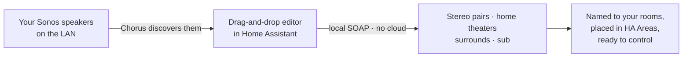

# Chorus

**Pair. Surround. Bond.** — build the Sonos layouts the app won't, right inside Home Assistant.

Chorus makes your Sonos a **first-class part of Home Assistant**. Drag speakers around a
room to build stereo pairs and home theaters — including the dedicated front surrounds and
mixed-model rigs the Sonos app flatly **refuses** to create — from a native panel in your
sidebar. Sets take their room's name and land in your Home Assistant **Areas**, so Sonos
stops being a walled garden and simply becomes part of your home. Everything runs
**locally on your LAN** — no cloud, no Sonos account.


- **Home-Assistant-first.** A native drag-and-drop panel, your Areas, your naming. You
  configure Sonos where you already run your home — not in a separate app you juggle.
- **Layouts the app won't build.** Dedicated front surrounds, mixed-model satellites
  (Era 300s or Symfonisks as an Arc's rears *or* fronts), and a sub bonded to a stereo
  pair or a lone speaker — not just to a soundbar.
- **One zone, one name.** A bonded set is named after its room; swapping L/R never renames
  it, and moving it to another room renames + re-homes it for you.
- **Control, not just config.** Group volume and audio settings live in the panel — and
  every action is also a Home Assistant service, so your speakers drop straight into
  automations.
- **Local and private.** It speaks the Sonos LAN API (port 1400) directly. Nothing leaves
  your network.
- **Staged, not surprising.** Arrange freely; nothing is written to your speakers until you
  review the plan and hit **Apply**.

**Install:** HACS → ⋮ → *Custom repositories* → add this repo as an **Integration** →
Download → restart Home Assistant → add the **Chorus** integration. Local, account-free.
([full steps ↓](#install-hacs-custom-repository))

## The idea



## Screenshots

**Overview** — every room and its bonded sets, at a glance.


---

## Status

**Working and installed on real Home Assistant.**

- ✅ **Bonding on hardware** — create/dissolve stereo pairs, add/remove
  home-theater satellites (rears *and* front surrounds), bond a sub to a pair or
  a lone speaker, snapshot & restore. Topology parsed live from `ZoneGroupState`,
  including bonded/invisible members, so everything resolves by name or UID.
- ✅ **Native editor panel** — drag-and-drop (desktop) / tap-to-assign (mobile)
  for building layouts, a live **Overview**, and a settle-progress bar that names
  each speaker as it reconnects.
- ✅ **Zone names follow the room** — a bonded set is one zone with one name;
  swapping L/R never renames it, moving/creating adopts the room name.
- ✅ **Identify** — chime one speaker to find it, played directly over SOAP (no
  dependency on HA's Sonos integration, so it works on freshly-freed speakers).
- ✅ **Fixed line-out volume** toggle for a Connect / Port / Amp / Five.
- 🔜 **Next:** HACS default-store submission + a brand icon.

---

## Why Chorus exists

Home Assistant can adjust settings on an *already-bonded* home theater (sub gain,
night sound, and so on), but it **cannot create or dissolve the bonds
themselves** — no stereo pairing, no adding or removing surrounds, no building a
5.1 layout. This is a long-standing gap, confirmed by the built-in Sonos
integration's own maintainer.

The capability exists in the undocumented **local UPnP/SOAP API on port 1400** —
the same API third-party tools use — but no HA-native, installable product
exposed it. Chorus does, entirely on your LAN:

- **No cloud, no Sonos account** — everything stays on your network.
- **Layouts the Sonos app won't build** — dedicated front surrounds, mixed-model
  satellites (e.g. Era 300s or Symfonisks as an Arc's rears *or* fronts).
- **Staged, not surprising** — the panel stages your changes locally; nothing is
  written to your speakers until you review and **Apply**.

---

## Features

### The editor panel

- **Drag-and-drop (desktop) / tap-to-assign (mobile)** — build layouts room by
  room, the same operations in two input models so it works on a phone.
- **A spatial home-theater stage** — a top-down room with Front / Rear / Sub
  positions around your seat; drop a speaker onto a position to bond it.
- **Live Overview** — an at-a-glance map of every room and its bonded sets.
- **Staged changes with a plain-language Apply** — arrange freely, see exactly
  what will change, and commit in one step (independent changes run in parallel,
  dependent ones serialize), with a **settle-progress bar** that names each
  speaker as it reconnects.

### Bonding — the thing Home Assistant can't do

- **Stereo pairs**, including **mixed models** the Sonos app refuses to pair.
- **Home theaters** — add and remove surrounds, **rears *and* dedicated front
  surrounds**, with mixed-model satellites (Era 300s, Symfonisks) as fronts *or*
  rears.
- **Subs** — bond a sub to a soundbar, a **stereo pair**, or a **lone speaker**.
- **Swap L/R, separate, dissolve** — take a layout apart as easily as you built it.

### Rooms & naming

- **Names follow the room** — a bonded set is one zone with one name; swapping
  L/R never renames it, and creating or moving a set adopts the room's name
  (de-duplicated `Room 2` when a room holds more than one zone).
- **Move between rooms** — reassigns the Home Assistant Area *and* renames the
  Sonos zone.

### Extras

- **Identify** — chime one speaker to find it, played directly over SOAP (no
  dependency on HA's Sonos integration, so it works even on a just-freed speaker).
- **Fixed line-out volume** — a toggle for a Connect / Port / Amp / Five.
- **Audio settings, surfaced not reinvented** — EQ (bass/treble/loudness), sub /
  surround levels, night sound, speech enhancement already exist as HA entities;
  Chorus shows them in the room view. It owns the one thing HA can't: **bonding**.
- **Home-theater snapshot & restore** — building a home theater snapshots the
  soundbar's layout first (a mid-sequence failure is recoverable), and
  `chorus.snapshot` / `chorus.restore` save and re-apply an HT layout on demand.

### Safety

- **Capability validation** — won't use a non-soundbar as a home-theater primary,
  pair an unpairable speaker, or drop a non-sub into the sub slot.
- **Friendly errors** — raw SOAP faults are translated (e.g. `401` → "must target
  a soundbar"; a timeout → "couldn't reach the speaker — try again").
- **Discovery-driven** — no hardcoded IPs, UIDs, or room names.

---

## Services (for automations)

Everything the panel does is also a service, under **Developer Tools → Actions** —
speakers referenced by Sonos room name or RINCON UID.

| Service | What it does |
| --- | --- |
| `chorus.create_stereo_pair` | Bond two speakers into a stereo pair (mixed models allowed). |
| `chorus.separate` | Split a stereo pair back into two standalone speakers. |
| `chorus.set_home_theater` | Bond surrounds + sub to a soundbar — snapshots first, then adds each channel one satellite at a time with poll-until-settled + retry. |
| `chorus.remove_home_theater` | Remove one satellite, or (none named) dissolve the whole home theater. |
| `chorus.add_pair_sub` / `chorus.remove_pair_sub` | Bond/unbond a sub to a stereo pair or a lone speaker. |
| `chorus.move` | Move a speaker to another room (renames its zone + reassigns the HA Area). |
| `chorus.rename` | Rename a speaker's Sonos zone in place. |
| `chorus.identify` | Play a chime on one speaker so you can tell which unit it is. |
| `chorus.set_fixed_output` | Toggle fixed line-out volume (Connect / Port / Amp / Five). |
| `chorus.snapshot` / `chorus.restore` | Save / re-apply a soundbar's home-theater layout. |

---

## Install (HACS custom repository)

1. In **HACS → ⋮ → Custom repositories**, add this repo with category
   **Integration**.
2. Open **Chorus** and **Download** it, then **restart Home Assistant**.
3. **Settings → Devices & Services → Add Integration → Chorus.** (It's local and
   account-free — one click to enable.)

## Use

Open **Chorus** in the sidebar and build layouts visually — drag or tap speakers
onto Front / Rear / Sub positions, pair them, review the staged changes, and
**Apply**. Everything is also scriptable for automations:

```yaml
# Build a 5.1 home theater around a soundbar
action: chorus.set_home_theater
data:
  soundbar: Living Room
  lf: Front Left
  rf: Front Right
  lr: Rear Left
  rr: Rear Right
  sw: Sub

# Pair two speakers (mixed models allowed)
action: chorus.create_stereo_pair
data:
  left: Living Room
  right: Living Room (right)
```

---

## How it works (architecture)

Everything lives in `custom_components/chorus/` and is **discovery-driven** —
speakers, IPs, UIDs and models are pulled live; nothing about your home is baked
in.

- **`sonos.py`** — the local SOAP backend. Implements the hardware-validated
  recipes (`CreateStereoPair` / `SeparateStereoPair`, `AddHTSatellite` /
  `RemoveHTSatellite`, `SetZoneAttributes`) and the hard-won write strategy:
  **one satellite per call**, **poll-until-settled**, and **retry-on-`800`** to
  survive the transient state Sonos passes through after a bond change. It treats
  the **doubly-unescaped `ZoneGroupState`** (specifically `HTSatChanMapSet`) as
  the source of truth.
- **`const.py`** — the model → capability registry (`primary` / `surround` /
  `pair` / `sub` / `height`) matched against the model string, with a **graceful
  fallback** so unknown or future Sonos models still work (treated as a generic
  home speaker) instead of breaking.
- **`coordinator.py`** — `soco` discovery into a live inventory keyed by UID
  (name / IP / model).
- **`config_flow.py`** — a single, local, account-free config entry.
- **service layer (`__init__.py` + `services.yaml`)** — resolves names against
  the live inventory, validates capabilities, and calls the backend off the event
  loop.

The bond map is a compact channel string, e.g.:

```
<soundbar-uid>:CC;<sat-uid>:LF|RF|LR|RR|SW
```

Full recipes, the channel-map format, the error taxonomy, and the write-strategy
gotchas are documented in **[`docs/SPIKE_FINDINGS.md`](docs/SPIKE_FINDINGS.md)**.

---

## What's next

- Submit to the **HACS default store** and add a brand icon via
  `home-assistant/brands`.
- Broaden device coverage and keep the bonding editor sharp. Bonding stays the
  core — Chorus is deliberately *not* a general "Sonos everything" app.

---

## Safety & caveats

- **Undocumented API.** These calls use Sonos's local UPnP/SOAP interface; a
  future firmware or app change could alter or remove them. There's no
  compatibility matrix — treat it as best-effort.
- **Staged, but no global undo.** The editor stages changes locally — nothing
  reaches your speakers until you Apply. Building a home theater snapshots the
  soundbar's layout first, and `snapshot`/`restore` cover HT layouts — but there's
  no one-click undo for every operation, so review the summary before you Apply.
- **Trueplay / tuning.** Custom layouts (mixed-model satellites, dedicated
  fronts) are ones the Sonos app won't build itself, so some of its tuning (like
  Trueplay) may not fully apply. Everything else works normally.
- **"Needs attention" in the Sonos app.** A room Chorus configures may briefly
  show "needs attention" in the Sonos app. The bond is correct and works — verified
  byte-identical to an app-made pair; the flag is a cloud-side "was this set up
  through our app?" marker Chorus can't set (it's local-only, no account). It
  clears on its own over time, or immediately if you re-pair once in the app.

---

## License

Chorus is **dual-licensed**:

- **Open source:** [GNU AGPL-3.0](LICENSE) — free to use, study, modify, and
  share. Note the AGPL's strong copyleft: ship it (or run a modified version as a
  network service) and you must release your complete corresponding source under
  the AGPL too. For home and hobby use this changes nothing.
- **Commercial:** if you want to build on Chorus **without** the AGPL's
  source-disclosure obligations — e.g. inside a closed-source product, appliance,
  or hosted service — a separate paid commercial license is available. See
  [`COMMERCIAL-LICENSE.md`](COMMERCIAL-LICENSE.md).

Contributions are welcome under the terms in [`CLA.md`](CLA.md), which keeps this
dual-licensing possible. © 2026 Will Blaschko.
