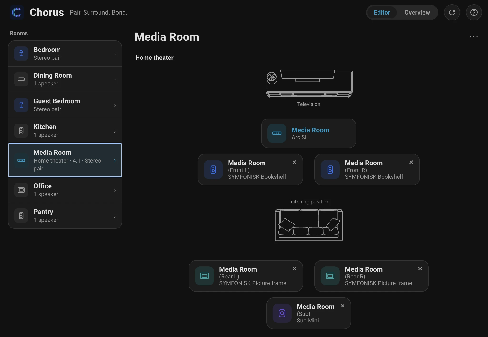
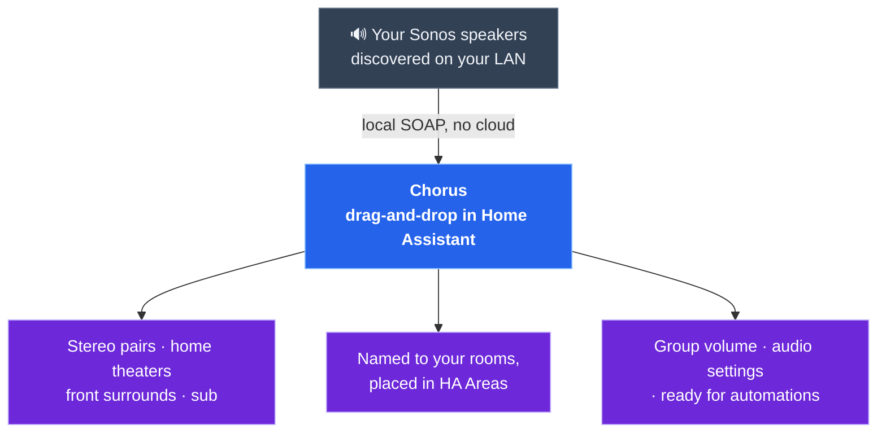
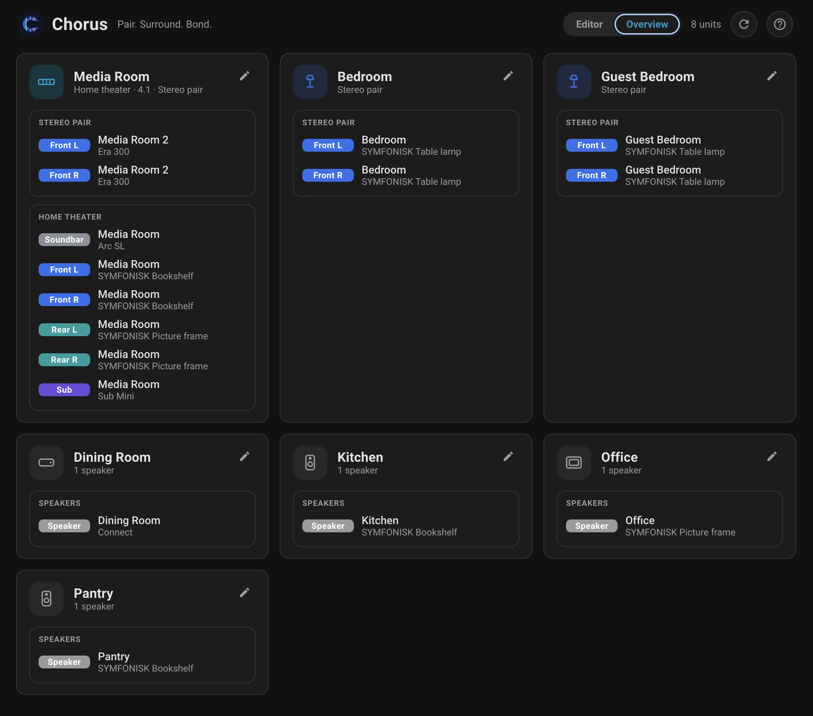

# Chorus

**Pair. Surround. Bond.** — build the Sonos layouts the app won't, right inside Home Assistant.

Chorus makes your Sonos a **first-class part of Home Assistant**. Drag speakers around a
room to build stereo pairs and home theaters — including the dedicated front surrounds and
mixed-model rigs the Sonos app flatly **refuses** to create — from a native panel in your
sidebar. Sets take their room's name and land in your Home Assistant **Areas**, so Sonos
stops being a walled garden and simply becomes part of your home. Everything runs
**locally on your LAN** — no cloud, no Sonos account.

- **Home-Assistant-first.** A native drag-and-drop panel, your Areas, your naming. You
  configure Sonos where you already run your home — not in a separate app you juggle.
- **Layouts the app won't build.** Dedicated front surrounds, mixed-model satellites
  (Era 300s or Symfonisks as an Arc's rears *or* fronts), and a sub bonded to a stereo
  pair or a lone speaker — not just to a soundbar.
- **One zone, one name.** A bonded set is named after its room; swapping L/R never renames
  it, and moving it to another room renames + re-homes it for you.
- **Control, not just config.** Group volume and audio settings live in the panel — and
  every action is also a Home Assistant service, so your speakers drop straight into
  automations.
- **Local and private.** It speaks the Sonos LAN API (port 1400) directly. Nothing leaves
  your network.
- **Staged, not surprising.** Arrange freely; nothing is written to your speakers until you
  review the plan and hit **Apply**.

**Install:** HACS → ⋮ → *Custom repositories* → add this repo as an **Integration** →
Download → restart Home Assistant → add the **Chorus** integration. Local, account-free.
([full steps ↓](#install-hacs-custom-repository))

## The idea

## Screenshots

**Overview** — every room and its bonded sets, at a glance.

---

## Status

**Working and installed on real Home Assistant.**

- ✅ **Bonding on hardware** — create/dissolve stereo pairs, add/remove
  home-theater satellites (rears *and* front surrounds), and bond a sub to a pair
  or a lone speaker. Topology parsed live from `ZoneGroupState`, including
  bonded/invisible members, so everything resolves by name or UID.
- ✅ **Native editor panel** — drag-and-drop (desktop) / tap-to-assign (mobile)
  for building layouts, a live **Overview**, and a settle-progress bar that names
  each speaker as it reconnects.
- ✅ **Zone names follow the room** — a bonded set is one zone with one name;
  swapping L/R never renames it, moving/creating adopts the room name.
- ✅ **Identify** — chime one speaker to find it, played directly over SOAP (no
  dependency on HA's Sonos integration, so it works on freshly-freed speakers).
- ✅ **Fixed line-out volume** toggle for a Connect / Port / Amp / Five.
- 🔜 **Next:** HACS default-store submission + a brand icon.

---

## Why Chorus exists

Home Assistant can adjust settings on an *already-bonded* home theater (sub gain,
night sound, and so on), but it **cannot create or dissolve the bonds
themselves** — no stereo pairing, no adding or removing surrounds, no building a
5.1 layout. This is a long-standing gap, confirmed by the built-in Sonos
integration's own maintainer.

The capability exists in the undocumented **local UPnP/SOAP API on port 1400** —
the same API third-party tools use — but no HA-native, installable product
exposed it. Chorus does, entirely on your LAN:

- **No cloud, no Sonos account** — everything stays on your network.
- **Layouts the Sonos app won't build** — dedicated front surrounds, mixed-model
  satellites (e.g. Era 300s or Symfonisks as an Arc's rears *or* fronts).
- **Staged, not surprising** — the panel stages your changes locally; nothing is
  written to your speakers until you review and **Apply**.

---

## Features

### The editor panel

- **Drag-and-drop (desktop) / tap-to-assign (mobile)** — build layouts room by
  room, the same operations in two input models so it works on a phone.
- **A spatial home-theater stage** — a top-down room with Front / Rear / Sub
  positions around your seat; drop a speaker onto a position to bond it.
- **Live Overview** — an at-a-glance map of every room and its bonded sets.
- **Staged changes with a plain-language Apply** — arrange freely, see exactly
  what will change (every row names the *device* and what happens to it), and
  commit in one step. Independent changes run in parallel, dependent ones
  serialize, with a progress bar that tracks actions completed then the settle.
- **Move by dragging** — drop a loose speaker onto another room in the list to
  move it there (its Sonos zone follows the new room).
- **Deep links & resume** — every view has its own URL (refresh and the browser
  Back button just work), and if part of an Apply fails you get a one-click
  **Retry** for exactly the steps that didn't land.

### Bonding — the thing Home Assistant can't do

- **Stereo pairs**, including **mixed models** the Sonos app refuses to pair.
- **Home theaters** — add and remove surrounds, **rears *and* dedicated front
  surrounds**, with mixed-model satellites (Era 300s, Symfonisks) as fronts *or*
  rears.
- **Subs** — bond a sub to a soundbar, a **stereo pair**, or a **lone speaker**.
  Free-floating subs show on the Overview under **Available subs** — add one to
  any set in a click.
- **Swap L/R, separate, dissolve** — take a layout apart as easily as you built it.

### Rooms & naming

Chorus is **opinionated about naming** — it takes a deliberate stance so you don't
have to manage zone names by hand.

- **Names follow the room** — a bonded set is one zone with one name; swapping
  L/R never renames it, and creating or moving a set adopts the room's name
  (de-duplicated `Room 2` when a room holds more than one zone).
- **Move between rooms** — reassigns the Home Assistant Area *and* renames the
  Sonos zone.
- **Opinionated & self-healing** — if two zones in a room end up sharing a name,
  Chorus detects it and stages the fix automatically; **offline speakers**
  (unplugged / powered off) are flagged and never operated on blindly.

### Extras

- **Identify** — chime one speaker to find it, played directly over SOAP (no
  dependency on HA's Sonos integration, so it works even on a just-freed speaker).
- **Fixed line-out volume** — a toggle for a Connect / Port / Amp / Five.
- **Audio settings, surfaced not reinvented** — EQ (bass/treble/loudness), sub /
  surround levels, night sound, speech enhancement already exist as HA entities;
  Chorus shows them in the room view. It owns the one thing HA can't: **bonding**.

### Safety

- **Capability validation** — won't use a non-soundbar as a home-theater primary,
  pair an unpairable speaker, or drop a non-sub into the sub slot.
- **Friendly errors** — raw SOAP faults are translated (e.g. `401` → "must target
  a soundbar"; a timeout → "couldn't reach the speaker — try again").
- **Discovery-driven** — no hardcoded IPs, UIDs, or room names.

---

## Power features & docs

Chorus is a full Home Assistant integration under the hood — **every action is also a
service**, and the bonding runs over local SOAP on your LAN. Dig in:

- **[Services & scripting →](docs/ADVANCED.md#services)** — fire any bonding, volume, or
  identify action from an automation (all 12+ services, with YAML examples).
- **[How it works →](docs/ADVANCED.md#how-it-works-architecture)** — the local Sonos API,
  the write strategy, and the model → capability registry.
- **[Safety & caveats →](docs/ADVANCED.md#safety--caveats)** — undocumented API, no global
  undo, and the Sonos-app "needs attention" flag (all benign, but worth knowing).
- **[Known issues →](KNOWN_ISSUES.md)** — the short list of rough edges and their workarounds.

---

## Install (HACS custom repository)

1. In **HACS → ⋮ → Custom repositories**, add this repo with category
   **Integration**.
2. Open **Chorus** and **Download** it, then **restart Home Assistant**.
3. **Settings → Devices & Services → Add Integration → Chorus.** (It's local and
   account-free — one click to enable.)

## Use

Open **Chorus** in the sidebar and build layouts visually — drag or tap speakers onto
Front / Rear / Sub positions, pair them, review the staged changes, and **Apply**. Prefer
YAML? Every action is also a service — see
[**Services & scripting**](docs/ADVANCED.md#services).

---

## What's next

- Submit to the **HACS default store** and add a brand icon via
  `home-assistant/brands`.
- Broaden device coverage and keep the bonding editor sharp. Bonding stays the
  core — Chorus is deliberately *not* a general "Sonos everything" app.

---

## How to support

Chorus is free, and I'm not looking for donations — I do alright. But if it earned
its keep in your home and you'd like to give back, please put it toward something
that needs it more than I do:

**❤ [Donate to the World Wildlife Fund →](https://protect.worldwildlife.org/)**

That's the only "support" ask you'll find here. (Businesses shipping Chorus
commercially: see the [License](#license) below.)

---

## License

Chorus is **dual-licensed**:

- **Open source:** [GNU AGPL-3.0](LICENSE) — free to use, study, modify, and
  share. Note the AGPL's strong copyleft: ship it (or run a modified version as a
  network service) and you must release your complete corresponding source under
  the AGPL too. For home and hobby use this changes nothing.
- **Commercial:** if you want to build on Chorus **without** the AGPL's
  source-disclosure obligations — e.g. inside a closed-source product, appliance,
  or hosted service — a separate paid commercial license is available. See
  [`COMMERCIAL-LICENSE.md`](COMMERCIAL-LICENSE.md).

Contributions are welcome under the terms in [`CLA.md`](CLA.md), which keeps this
dual-licensing possible. © 2026 Will Blaschko.
